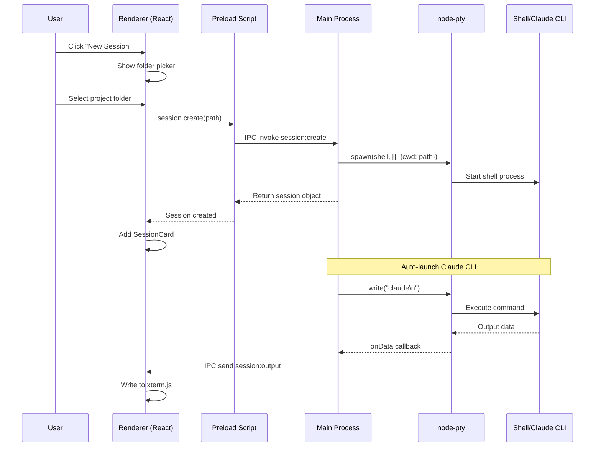
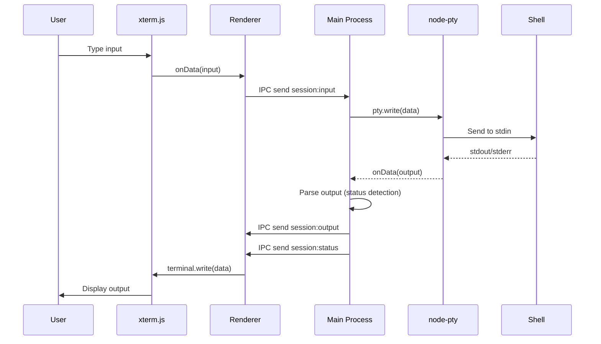

# Claude Code Manager - Project Schema Index

## Project Overview

**Claude Code Manager** is a multi-project frontend application for the Claude Code CLI. It provides a graphical interface for managing multiple Claude coding sessions simultaneously, with integrated terminal emulation, file system browsing, and web browsing capabilities.

The application enables developers to:
- Run multiple Claude CLI sessions in parallel across different projects
- Monitor Claude's activity status (thinking, editing, idle)
- Track files being edited by Claude in real-time
- Browse project file trees with live updates
- Access web documentation alongside coding sessions

---

## Technology Stack

| Technology | Version | Purpose |
|------------|---------|---------|
| **Electron** | 29.4.6 | Cross-platform desktop framework |
| **electron-vite** | 2.3.0 | Fast build tooling for Electron |
| **React** | 18.3.1 | UI component library |
| **TypeScript** | 5.7.2 | Type-safe JavaScript |
| **xterm.js** | 5.3.0 | Terminal emulator component |
| **node-pty** | @cdktf/node-pty-prebuilt-multiarch 0.10.2 | Pseudoterminal for spawning shells |
| **Zustand** | 4.5.2 | State management |
| **TailwindCSS** | 3.4.16 | Utility-first CSS framework |
| **react-resizable-panels** | 2.1.7 | Resizable panel layout |
| **react-arborist** | 3.4.0 | Tree view component |
| **chokidar** | 3.6.0 | File system watcher |
| **electron-store** | 8.2.0 | Persistent configuration storage |

---

## Architecture Diagram

```mermaid
graph TB
    subgraph Electron["Electron Application"]
        subgraph Main["Main Process (Node.js)"]
            MP[index.ts<br/>App Entry]
            SM[SessionManager<br/>PTY Sessions]
            CS[ConfigStore<br/>Settings]
            FW[FileWatcher<br/>FS Events]
            IPC[IPC Handlers<br/>Main<->Renderer]

            MP --> SM
            MP --> CS
            MP --> IPC
            IPC --> FW
        end

        subgraph Preload["Preload Scripts"]
            PL[preload/index.ts<br/>Context Bridge]
        end

        subgraph Renderer["Renderer Process (React)"]
            App[App.tsx<br/>Root Component]

            subgraph Layout["Layout Components"]
                TB[TitleBar]
                SB[Sidebar]
            end

            subgraph Session["Session Components"]
                SG[SessionGrid]
                SC[SessionCard]
                TM[Terminal]
                NSM[NewSessionModal]
            end

            subgraph FileSystem["File System"]
                FT[FileTree]
                ET[EditTracker]
            end

            subgraph Browser["Browser"]
                BR[Browser<br/>WebView]
            end

            subgraph State["State Management"]
                SS[session-store<br/>Zustand]
                US[ui-store<br/>Zustand]
            end

            App --> Layout
            App --> Session
            App --> FileSystem
            App --> Browser
            Session --> State
        end
    end

    subgraph External["External"]
        PTY[node-pty<br/>Native Module]
        CLI[Claude CLI<br/>Spawned Process]
        FS[File System]
    end

    SM --> PTY
    PTY --> CLI
    FW --> FS

    Main <--> |IPC| Preload
    Preload <--> |Context Bridge| Renderer

    style Main fill:#1a1a2e
    style Preload fill:#16213e
    style Renderer fill:#0f3460
    style External fill:#533483
```



---

## Directory Structure

```
claude-code-manager/
|-- package.json                    # Project dependencies and scripts
|-- electron.vite.config.ts         # electron-vite build configuration
|-- tsconfig.json                   # TypeScript configuration
|-- tailwind.config.js              # TailwindCSS configuration
|-- postcss.config.js               # PostCSS configuration
|
|-- src/
|   |-- main/                       # Main process (Node.js)
|   |   |-- index.ts                # Application entry point
|   |   |-- ipc/
|   |   |   |-- index.ts            # IPC handler registration
|   |   |-- services/
|   |       |-- session-manager.ts  # PTY session management
|   |       |-- config-store.ts     # Persistent configuration
|   |       |-- file-watcher.ts     # File system monitoring
|   |
|   |-- preload/                    # Preload scripts
|   |   |-- index.ts                # Context bridge API exposure
|   |
|   |-- renderer/                   # Renderer process (React)
|   |   |-- index.html              # HTML entry point
|   |   |-- main.tsx                # React entry point
|   |   |-- App.tsx                 # Root component
|   |   |
|   |   |-- components/
|   |   |   |-- layout/
|   |   |   |   |-- TitleBar.tsx    # Custom window title bar
|   |   |   |   |-- Sidebar.tsx     # Navigation sidebar
|   |   |   |
|   |   |   |-- session/
|   |   |   |   |-- SessionGrid.tsx    # Grid of active sessions
|   |   |   |   |-- SessionCard.tsx    # Individual session display
|   |   |   |   |-- NewSessionModal.tsx # Create session dialog
|   |   |   |
|   |   |   |-- terminal/
|   |   |   |   |-- Terminal.tsx    # xterm.js wrapper
|   |   |   |
|   |   |   |-- file-explorer/
|   |   |   |   |-- FileTree.tsx    # Project file tree
|   |   |   |
|   |   |   |-- edit-tracker/
|   |   |   |   |-- EditTracker.tsx # Edited files display
|   |   |   |
|   |   |   |-- browser/
|   |   |   |   |-- Browser.tsx     # Embedded web browser
|   |   |   |
|   |   |   |-- ui/
|   |   |       |-- button.tsx      # Button component
|   |   |       |-- input.tsx       # Input component
|   |   |
|   |   |-- stores/
|   |   |   |-- session-store.ts    # Session state (Zustand)
|   |   |   |-- ui-store.ts         # UI state (Zustand)
|   |   |
|   |   |-- styles/
|   |   |   |-- globals.css         # Global styles + Tailwind
|   |   |
|   |   |-- lib/
|   |       |-- utils.ts            # Utility functions
|   |
|   |-- shared/                     # Shared types between processes
|       |-- types.ts                # TypeScript interfaces
|
|-- dist/                           # Build output
|   |-- main/                       # Compiled main process
|   |-- preload/                    # Compiled preload scripts
|   |-- renderer/                   # Compiled renderer
|
|-- release/                        # Packaged application output
```

---

## Key Components Overview

### Main Process

#### `src/main/index.ts`
**Application Entry Point**

- Initializes Electron app lifecycle
- Creates BrowserWindow with custom frame (frameless)
- Sets up global service instances (SessionManager, ConfigStore)
- Registers IPC handlers
- Manages window events and cleanup

```typescript
// Key exports
export let sessionManager: SessionManager
export let configStore: ConfigStore
export function getMainWindow(): BrowserWindow | null
```

#### `src/main/services/session-manager.ts`
**PTY Session Management**

- Creates and manages pseudoterminal sessions using node-pty
- Spawns shell processes (PowerShell on Windows, bash on Unix)
- Parses Claude CLI output to detect activity status
- Tracks edited files through output pattern matching
- Handles session lifecycle (create, destroy, resize)

```typescript
// Key class
class SessionManager extends EventEmitter {
  create(projectPath: string): Session
  destroy(id: string): boolean
  write(id: string, data: string): boolean
  resize(id: string, cols: number, rows: number): boolean
}
```

#### `src/main/ipc/index.ts`
**IPC Handler Registration**

- Registers all IPC handlers for main-renderer communication
- Handles: Session management, File operations, Config, Window controls, Dialogs, Venv, Orchestrator, Git

#### `src/main/services/venv-manager.ts` (FEAT-001)
**Python Virtual Environment Management**

- Manages shared Python venv at `~/.autonomous-coding/venv/`
- Creates venv if not exists, installs dependencies (claude-code-sdk, python-dotenv)
- Security hardened: path traversal prevention, command injection protection
- Mutex for concurrent operations, timeout handling

```typescript
class VenvManager extends EventEmitter {
  async findSystemPython(): Promise<PythonCommand | null>
  async ensureVenv(): Promise<VenvStatus>
  async installPackages(packages: string[]): Promise<void>
  getPythonPath(): string
  getOrchestratorPath(): string
}
```

#### `src/main/services/orchestrator-runner.ts` (FEAT-002)
**Python Orchestrator Process Management**

- Spawns and manages Python orchestrator processes for autonomous workflows
- Supports phases: validation, generation, implementation
- Process lifecycle: start, stop, pause with signal handling
- Output streaming and progress parsing
- Rate limiting (5 concurrent, 50/hour), credential sanitization

```typescript
class OrchestratorRunner extends EventEmitter {
  async start(config: OrchestratorConfig): Promise<OrchestratorSession>
  async stop(sessionId: string): Promise<boolean>
  async pause(sessionId: string): Promise<boolean>
  getSession(sessionId: string): OrchestratorSession | undefined
  getAllSessions(): OrchestratorSession[]
  getWorkflowSessions(workflowId: string): OrchestratorSession[]
  cleanup(): void
}
```

#### `src/main/services/workflow-manager.ts` (FEAT-003)
**Autonomous Workflow State Management**

- Manages autonomous coding workflows stored in `.autonomous/` directories
- Workflow CRUD operations (create, read, update, delete, list)
- Persistent state storage as JSON files
- Status tracking: pending, validating, generating, implementing, paused, completed, error
- Progress tracking with test pass/fail counts and category breakdown
- Git worktree integration for isolated development branches
- Path traversal prevention, atomic file operations

**Storage Structure:**
```
{projectPath}/.autonomous/
├── workflows/{id}.json    # Workflow configuration
├── specs/{id}.txt         # Spec content files
├── progress/{id}.json     # Progress tracking data
└── worktrees/{id}/        # Git worktrees (optional)
```

```typescript
class WorkflowManager extends EventEmitter {
  async create(options: CreateWorkflowOptions): Promise<WorkflowConfig>
  async get(projectPath: string, workflowId: string): Promise<WorkflowConfig | null>
  async update(projectPath: string, workflowId: string, updates: UpdateWorkflowOptions): Promise<WorkflowConfig | null>
  async delete(projectPath: string, workflowId: string): Promise<boolean>
  async listForProject(projectPath: string): Promise<WorkflowConfig[]>
  listAll(): WorkflowConfig[]
  async updateStatus(projectPath: string, workflowId: string, status: WorkflowStatus, error?: string): Promise<WorkflowConfig | null>
  async updateProgress(projectPath: string, workflowId: string, progress: WorkflowProgress): Promise<WorkflowConfig | null>
  async getSpecContent(workflow: WorkflowConfig): Promise<string>
  async updateSpecContent(workflow: WorkflowConfig, content: string): Promise<void>
}
```

#### `src/main/services/progress-watcher.ts` (FEAT-004)
**File-based Progress Monitoring**

- Watches `feature_list.json` files in `.autonomous/` directories using chokidar
- Real-time progress calculation as tests pass/fail
- Category-based progress breakdown
- Emits progress events to renderer for live UI updates
- Multiple concurrent workflow watch support
- Debounced file change handling for stability

**Expected File Format:**
```json
{
  "features": [
    { "id": "feat-1", "name": "Feature 1", "category": "auth", "status": "passed" },
    { "id": "feat-2", "name": "Feature 2", "category": "api", "status": "pending" }
  ],
  "currentTest": "feat-2"
}
```

```typescript
class ProgressWatcher extends EventEmitter {
  async watch(workflowId: string, projectPath: string): Promise<ProgressSnapshot | null>
  async unwatch(workflowId: string): Promise<void>
  async unwatchAll(): Promise<void>
  async getProgress(workflowId: string): Promise<ProgressSnapshot | null>
  async refreshProgress(workflowId: string): Promise<ProgressSnapshot | null>
  getWatchedWorkflows(): string[]
  isWatching(workflowId: string): boolean
}
```

#### `src/main/services/schema-validator.ts` (FEAT-007)
**Schema Validation Orchestration**

- Integrates with OrchestratorRunner to trigger validation phase
- Parses `.autonomous/schema_validation.json` results
- Tracks validation status per project (idle, validating, complete, error)
- Path traversal prevention for file operations

```typescript
class SchemaValidator extends EventEmitter {
  async validate(projectPath: string, workflowId: string, model?: string): Promise<{ success: boolean; sessionId?: string; error?: string }>
  async getResult(projectPath: string): Promise<SchemaValidationResult | null>
  async clear(projectPath: string): Promise<void>
  getStatus(projectPath: string): ValidationState
}
```

### Preload

#### `src/preload/index.ts`
**Context Bridge API**

Exposes type-safe API to renderer via `window.electron`:

```typescript
interface ElectronAPI {
  session: {
    create(projectPath: string): Promise<...>
    destroy(sessionId: string): Promise<...>
    input(sessionId: string, data: string): void
    onOutput(callback): () => void
    onStatus(callback): () => void
  }
  files: { readDir, watch, unwatch, onChange }
  config: { get, set }
  window: { minimize, maximize, close }
  dialog: { selectFolder }
}
```

### Renderer Components

#### `src/renderer/App.tsx`
**Root React Component**

- Main layout with TitleBar, Sidebar, and content area
- Uses react-resizable-panels for flexible layout
- Subscribes to session status updates from main process

#### `src/renderer/components/terminal/Terminal.tsx`
**xterm.js Terminal Wrapper**

- Initializes xterm.js with GitHub dark theme
- Loads FitAddon for responsive sizing
- Loads WebLinksAddon for clickable URLs
- Bidirectional data flow with main process via IPC

#### `src/renderer/stores/session-store.ts`
**Zustand Session State**

- Manages list of active sessions
- Tracks active session selection
- Updates session status and edited files

#### `src/renderer/stores/autonomous-store.ts` (FEAT-008)
**Zustand Autonomous Coding State**

Comprehensive state management for the autonomous coding system:

- **Workflows**: CRUD operations, project grouping, active workflow tracking
- **Orchestrator Sessions**: Session lifecycle, output history, progress tracking
- **Progress**: Real-time test progress with category breakdown
- **Schema Validation**: Validation status and results per project
- **Venv**: Python environment status and creation progress

Key features:
- Automatic IPC subscription management via `initSubscriptions()`
- Output history limiting (1000 max, trimmed to 500) to prevent memory issues
- Type-safe integration with all preload APIs
- Computed helpers: `getActiveWorkflow()`, `getActiveSession()`, etc.

```typescript
interface AutonomousState {
  // State
  workflows: WorkflowConfig[]
  workflowsByProject: Record<string, WorkflowConfig[]>
  activeWorkflowId: string | null
  sessions: OrchestratorSession[]
  sessionsByWorkflow: Record<string, OrchestratorSession[]>
  activeSessionId: string | null
  sessionOutput: Record<string, OrchestratorOutput[]>
  progressByWorkflow: Record<string, ProgressSnapshot>
  schemaResults: Record<string, SchemaValidationResult>
  schemaStatus: Record<string, SchemaStatus>
  venvStatus: VenvStatus | null
  venvProgress: VenvCreationProgress | null

  // Workflow Actions
  refreshWorkflows(projectPath?: string): Promise<void>
  createWorkflow(options: CreateWorkflowOptions): Promise<WorkflowConfig | null>
  updateWorkflow(...): Promise<WorkflowConfig | null>
  deleteWorkflow(...): Promise<boolean>

  // Orchestrator Actions
  startOrchestrator(config: OrchestratorConfig): Promise<OrchestratorSession | null>
  stopOrchestrator(sessionId: string): Promise<boolean>
  pauseOrchestrator(sessionId: string): Promise<boolean>

  // Progress Actions
  watchProgress(workflowId: string, projectPath: string): Promise<void>
  unwatchProgress(workflowId: string): Promise<void>

  // Schema Actions
  validateSchema(projectPath: string, workflowId: string, model?: string): Promise<boolean>
  getSchemaResult(projectPath: string): Promise<SchemaValidationResult | null>

  // Venv Actions
  checkVenv(): Promise<VenvStatus | null>
  ensureVenv(): Promise<VenvStatus | null>
  upgradeVenv(): Promise<boolean>

  // Subscription management
  initSubscriptions(): () => void  // Returns cleanup function
}
```

---

## Native Module Dependencies

### @cdktf/node-pty-prebuilt-multiarch (0.10.2)

**Purpose:** Provides pseudoterminal functionality for spawning and communicating with shell processes.

**Why this fork?**
- Official `node-pty` lacks prebuilt binaries for recent Electron versions
- Includes prebuilt binaries for multiple platforms (Windows, macOS, Linux)
- Avoids native compilation issues with Python 3.13 (missing distutils)
- Compatible with Electron 29.x (ABI 120)

**Usage in code:**
```typescript
import { spawn, IPty } from '@cdktf/node-pty-prebuilt-multiarch'

const pty = spawn('powershell.exe', [], {
  name: 'xterm-256color',
  cols: 120,
  rows: 30,
  cwd: projectPath,
  env: process.env
})
```

### Build Scripts

```json
{
  "scripts": {
    "rebuild": "electron-rebuild -f -w @cdktf/node-pty-prebuilt-multiarch"
  }
}
```

---

## IPC Channel Reference

| Channel | Type | Description |
|---------|------|-------------|
| `session:create` | invoke | Create new PTY session |
| `session:destroy` | invoke | Terminate session |
| `session:list` | invoke | Get all sessions |
| `session:input` | send | Send input to PTY |
| `session:output` | on | Receive PTY output |
| `session:resize` | send | Resize terminal |
| `session:status` | on | Session status updates |
| `files:read-dir` | invoke | Read directory tree |
| `files:watch` | send | Start watching directory |
| `files:unwatch` | send | Stop watching |
| `files:change` | on | File system changes |
| `config:get` | invoke | Get configuration |
| `config:set` | invoke | Set configuration |
| `window:minimize` | send | Minimize window |
| `window:maximize` | send | Maximize/restore window |
| `window:close` | send | Close window |
| `dialog:select-folder` | invoke | Open folder picker |
| `venv:status` | invoke | Get venv status |
| `venv:ensure` | invoke | Ensure venv exists |
| `venv:upgrade` | invoke | Upgrade venv packages |
| `venv:progress` | on | Venv creation progress |
| `orchestrator:start` | invoke | Start orchestrator session |
| `orchestrator:stop` | invoke | Stop orchestrator session |
| `orchestrator:pause` | invoke | Pause orchestrator session |
| `orchestrator:get-session` | invoke | Get session by ID |
| `orchestrator:get-all-sessions` | invoke | Get all sessions |
| `orchestrator:get-workflow-sessions` | invoke | Get sessions for workflow |
| `orchestrator:cleanup` | invoke | Clean up completed sessions |
| `orchestrator:output` | on | Orchestrator output events |
| `orchestrator:progress` | on | Orchestrator progress events |
| `orchestrator:session` | on | Orchestrator session updates |
| `workflow:create` | invoke | Create new workflow |
| `workflow:get` | invoke | Get workflow by ID |
| `workflow:update` | invoke | Update workflow properties |
| `workflow:delete` | invoke | Delete workflow and files |
| `workflow:list` | invoke | List all workflows (cached) |
| `workflow:list-for-project` | invoke | List workflows for project |
| `workflow:update-status` | invoke | Update workflow status |
| `workflow:update-progress` | invoke | Update workflow progress |
| `workflow:change` | on | Workflow change events |
| `progress:watch` | invoke | Start watching workflow progress |
| `progress:unwatch` | invoke | Stop watching workflow progress |
| `progress:get` | invoke | Get current progress snapshot |
| `progress:update` | on | Progress update events |
| `schema:validate` | invoke | Trigger schema validation |
| `schema:get-result` | invoke | Get validation result |
| `schema:clear` | invoke | Clear validation result |
| `schema:status` | invoke/on | Get/observe validation status |

---

## Type Definitions

### Core Types (`src/shared/types.ts`)

```typescript
interface Session {
  id: string
  projectPath: string
  projectName: string
  status: SessionStatus
  editedFiles: EditedFile[]
  createdAt: number
}

type SessionStatus = 'idle' | 'running' | 'thinking' | 'editing' | 'error'

interface EditedFile {
  path: string
  action: FileAction
  timestamp: number
  status: 'pending' | 'completed'
}

type FileAction = 'read' | 'edit' | 'write' | 'create' | 'delete'

interface FileNode {
  id: string
  name: string
  path: string
  isDirectory: boolean
  children?: FileNode[]
  isEdited?: boolean
}

interface AppConfig {
  claudeCliPath: string
  defaultProjectsDir: string
  theme: 'dark' | 'light' | 'system'
  fontSize: number
  recentProjects: string[]
}
```

### Orchestrator Types (`src/shared/types.ts`)

```typescript
type OrchestratorPhase = 'validation' | 'generation' | 'implementation'
type OrchestratorStatus = 'idle' | 'starting' | 'running' | 'paused' | 'stopping' | 'completed' | 'error'
type OrchestratorOutputType = 'stdout' | 'stderr' | 'system' | 'progress'

interface OrchestratorConfig {
  projectPath: string
  workflowId: string
  phase: OrchestratorPhase
  model?: string
  supabaseProjectId?: string
  specFile?: string
}

interface OrchestratorSession {
  id: string
  config: OrchestratorConfig
  status: OrchestratorStatus
  phase: OrchestratorPhase
  startedAt: number
  endedAt?: number
  exitCode?: number
  error?: string
  testsTotal?: number
  testsPassing?: number
}

interface OrchestratorOutput {
  sessionId: string
  type: OrchestratorOutputType
  data: string
  timestamp: number
}

interface OrchestratorProgress {
  sessionId: string
  phase: OrchestratorPhase
  testsTotal?: number
  testsPassing?: number
  currentTest?: string
  message?: string
}
```

### Workflow Types (`src/shared/types.ts`)

```typescript
type WorkflowStatus = 'pending' | 'validating' | 'generating' | 'implementing' | 'paused' | 'completed' | 'error'

interface WorkflowConfig {
  id: string
  name: string
  description?: string
  projectPath: string
  worktreePath?: string
  specFile: string
  model: string
  status: WorkflowStatus
  createdAt: number
  updatedAt: number
  startedAt?: number
  completedAt?: number
  progress?: WorkflowProgress
  schemaValidation?: SchemaValidationResult
  error?: string
}

interface WorkflowProgress {
  phase: OrchestratorPhase
  testsTotal: number
  testsPassing: number
  currentTest?: string
  categories?: CategoryProgress[]
}

interface CategoryProgress {
  name: string
  total: number
  passing: number
}

interface SchemaValidationResult {
  valid: boolean
  discrepancies: SchemaDiscrepancy[]
  validatedAt: number
}

interface SchemaDiscrepancy {
  type: 'missing' | 'outdated' | 'inconsistent'
  location: string
  message: string
  severity: 'warning' | 'error'
}

interface CreateWorkflowOptions {
  projectPath: string
  name: string
  description?: string
  specContent: string
  model?: string
  useWorktree?: boolean
  worktreeBranch?: string
}

interface UpdateWorkflowOptions {
  name?: string
  description?: string
  status?: WorkflowStatus
  progress?: WorkflowProgress
  error?: string
}
```

### Progress Types (`src/shared/types.ts`)

```typescript
interface FeatureListEntry {
  id: string
  name: string
  category: string
  status: 'pending' | 'in_progress' | 'passed' | 'failed'
  testFile?: string
  error?: string
}

interface ProgressSnapshot {
  workflowId: string
  timestamp: number
  total: number
  passing: number
  failing: number
  pending: number
  percentage: number
  categories: CategoryProgressDetail[]
  currentTest?: string
}

interface CategoryProgressDetail {
  name: string
  total: number
  passing: number
  failing: number
  pending: number
  percentage: number
}
```

---

## Build Configuration

### electron.vite.config.ts

Three separate build targets:
1. **main** - Node.js main process code
2. **preload** - Preload scripts with context isolation
3. **renderer** - React application with Vite + React plugin

```typescript
export default defineConfig({
  main: {
    plugins: [externalizeDepsPlugin()],
    build: { outDir: 'dist/main' }
  },
  preload: {
    plugins: [externalizeDepsPlugin()],
    build: { outDir: 'dist/preload' }
  },
  renderer: {
    plugins: [react()],
    root: 'src/renderer',
    build: { outDir: 'dist/renderer' }
  }
})
```

### Package Scripts

| Script | Description |
|--------|-------------|
| `npm run dev` | Start development server with hot reload |
| `npm run build` | Build for production |
| `npm run preview` | Preview production build |
| `npm run package` | Package with electron-builder |
| `npm run package:win` | Package for Windows (NSIS + ZIP) |
| `npm run package:mac` | Package for macOS (DMG + ZIP) |
| `npm run package:linux` | Package for Linux (AppImage + DEB) |
| `npm run rebuild` | Rebuild native modules for Electron |
| `npm run typecheck` | Run TypeScript type checking |
| `npm run lint` | Run ESLint |

---

## Related Schema Documentation

| Document | Path | Description |
|----------|------|-------------|
| Electron Native Modules | [architecture/electron-native-modules.md](./architecture/electron-native-modules.md) | Native module architecture and ABI compatibility |
| Native Module Build Flow | [flows/native-module-build-flow.md](./flows/native-module-build-flow.md) | Build process for native dependencies |
| node-pty Troubleshooting | [flows/troubleshooting-node-pty.md](./flows/troubleshooting-node-pty.md) | Common issues and solutions |
| node-pty Windows Fix | [issues/node-pty-windows-fix.md](./issues/node-pty-windows-fix.md) | Detailed fix for Windows build failures |

---

## Data Flow Diagrams

### Session Creation Flow



### Terminal I/O Flow



---

## Search Keywords

`Claude Code Manager` `Electron` `React` `TypeScript` `xterm.js` `node-pty` `terminal` `PTY` `session management` `IPC` `electron-vite` `Zustand` `TailwindCSS` `multi-project` `Claude CLI` `frontend`

---

## Changelog

| Date | Version | Changes |
|------|---------|---------|
| 2024-12-10 | 1.0.0 | Initial project structure and documentation |
| 2025-12-16 | 1.1.0 | FEAT-001: Python Venv Management Service |
| 2025-12-16 | 1.2.0 | FEAT-002: Python Orchestrator Runner Service (security hardened) |
| 2025-12-16 | 1.3.0 | FEAT-003: Workflow Manager Service (CRUD, git worktree integration) |
| 2025-12-16 | 1.4.0 | FEAT-004: Progress Watcher Service (chokidar file monitoring) |
| 2025-12-16 | 1.5.0 | FEAT-005: Python Orchestrator Code (agent, client, security modules) |
| 2025-12-16 | 1.6.0 | FEAT-006: Brownfield Prompt Templates (validation, generation, coding) |
| 2025-12-16 | 1.7.0 | FEAT-007: Schema Validator Integration (orchestrator integration) |
| 2025-12-16 | 1.8.0 | FEAT-008: Autonomous Store (Zustand state management) |
| 2025-12-16 | 1.9.0 | FEAT-009: Workflow List Component (WorkflowCard, WorkflowCreate) |
| 2025-12-16 | 1.10.0 | FEAT-010: Progress Panel Component (CategoryProgress, real-time updates) |
| 2025-12-16 | 1.11.0 | FEAT-011: Spec Editor Component (view, edit, import, export) |
| 2025-12-16 | 1.12.0 | FEAT-012: Output Viewer Component (scrolling log, filtering, export) |
| 2025-12-16 | 1.13.0 | FEAT-013: Control Panel Component (start/pause/stop, model select) |
| 2025-12-16 | 1.14.0 | FEAT-014: Main UI Integration (AutonomousView, sidebar nav) |
| 2025-12-16 | 1.15.0 | FEAT-015: Global Configuration (autonomous settings, MCP, security) |
| 2025-12-22 | 1.16.0 | AI Merge Conflict Resolution System (3-tier resolution, OAuth auth) |
