# Electron + Native Modules Architecture

## Overview

This document provides comprehensive architecture documentation for building Electron applications with native Node.js modules, specifically focused on our Claude Code Manager implementation using `node-pty` for pseudo-terminal emulation.

---

## 1. Electron Architecture Overview

### Process Model

Electron applications run in a multi-process architecture derived from Chromium:

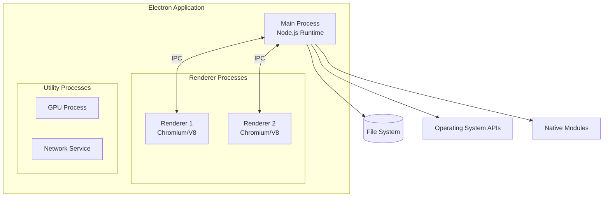

### Main Process vs Renderer Process

| Aspect | Main Process | Renderer Process |
|--------|-------------|------------------|
| **Runtime** | Node.js | Chromium (V8) |
| **Count** | Single instance | Multiple (one per window) |
| **Access** | Full Node.js APIs, native modules, OS APIs | DOM, Web APIs, limited Node via preload |
| **Security** | Trusted code execution | Sandboxed, untrusted content possible |
| **Responsibilities** | Window management, IPC, native operations | UI rendering, user interaction |
| **File Location** | `src/main/` | `src/renderer/` |

### Main Process (`src/main/index.ts`)

The main process is the entry point and orchestrator:

```typescript
// C:\claude_projects\claude-cli\claude-code-manager\src\main\index.ts

import { app, BrowserWindow, shell } from 'electron'
import { SessionManager } from './services/session-manager'

// Main process responsibilities:
// 1. Application lifecycle management
// 2. Window creation and management
// 3. Native module access (node-pty)
// 4. IPC handler registration
// 5. System tray, menus, dialogs
```

### IPC Communication Patterns

Inter-Process Communication (IPC) enables secure communication between processes:

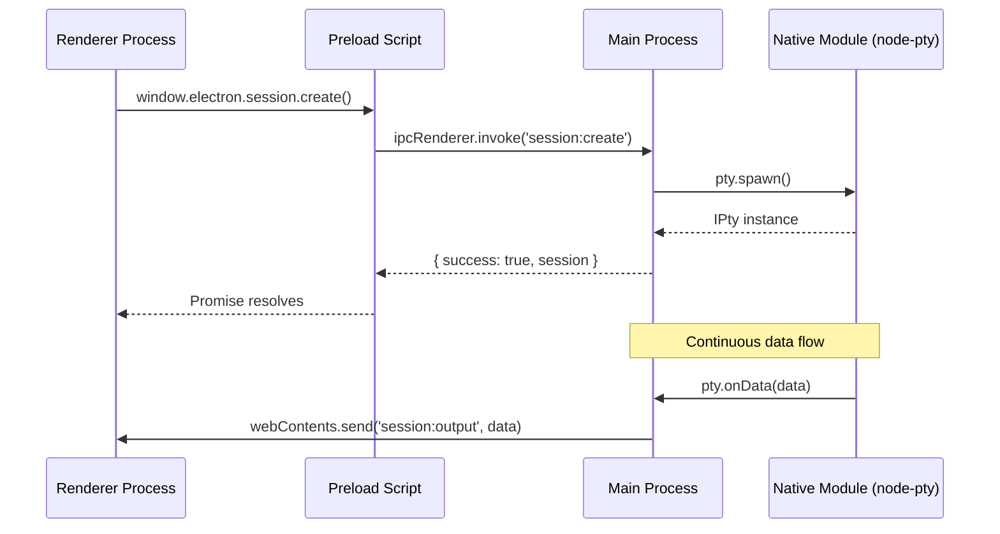

#### IPC Methods Comparison

| Method | Direction | Return Value | Use Case |
|--------|-----------|--------------|----------|
| `ipcRenderer.invoke()` | Renderer -> Main | Promise | Request-response (create session) |
| `ipcRenderer.send()` | Renderer -> Main | void | Fire-and-forget (resize terminal) |
| `ipcMain.handle()` | Main handler | Promise | Async operations |
| `ipcMain.on()` | Main handler | void | Event listeners |
| `webContents.send()` | Main -> Renderer | void | Push data to renderer |

#### IPC Channel Definitions (`src/shared/types.ts`)

```typescript
export const IPC_CHANNELS = {
  // Session management
  SESSION_CREATE: 'session:create',
  SESSION_DESTROY: 'session:destroy',
  SESSION_INPUT: 'session:input',
  SESSION_OUTPUT: 'session:output',
  SESSION_RESIZE: 'session:resize',
  // ... additional channels
} as const
```

### Preload Scripts

Preload scripts bridge the security gap between main and renderer processes:

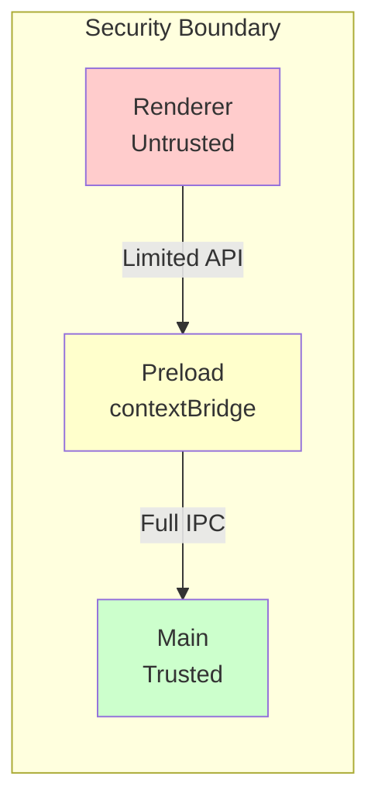

#### Preload Configuration (`src/main/index.ts`)

```typescript
new BrowserWindow({
  webPreferences: {
    preload: join(__dirname, '../preload/preload.js'),
    sandbox: false,           // Required for native modules
    contextIsolation: true,   // Security: isolate contexts
    nodeIntegration: false,   // Security: disable Node in renderer
  }
})
```

#### Preload Implementation (`src/preload/index.ts`)

```typescript
import { contextBridge, ipcRenderer } from 'electron'

// Expose a controlled API surface to the renderer
contextBridge.exposeInMainWorld('electron', {
  session: {
    create: (projectPath) => ipcRenderer.invoke('session:create', projectPath),
    onOutput: (callback) => {
      const handler = (_, output) => callback(output)
      ipcRenderer.on('session:output', handler)
      return () => ipcRenderer.removeListener('session:output', handler)
    }
  }
})
```

---

## 2. Native Module Architecture

### What Are Native Modules?

Native modules are Node.js addons written in C/C++ that provide:
- Access to system APIs not available in JavaScript
- Performance-critical operations
- Integration with existing C/C++ libraries

### N-API (Node-API)

N-API is a stable ABI for building native addons:

```
                    +------------------+
                    |  JavaScript      |
                    |  (Node.js/V8)    |
                    +--------+---------+
                             |
                    +--------v---------+
                    |     N-API        |
                    | (Stable ABI)     |
                    +--------+---------+
                             |
                    +--------v---------+
                    |  Native Code     |
                    |  (C/C++)         |
                    +--------+---------+
                             |
                    +--------v---------+
                    |  Operating       |
                    |  System APIs     |
                    +------------------+
```

### node-gyp Build System

`node-gyp` is the build tool for native modules:

```
binding.gyp         --> node-gyp configure --> build/config.gypi
(Build manifest)                            --> build/Makefile (Unix)
                                            --> build/*.vcxproj (Windows)

                    --> node-gyp build     --> build/Release/module.node
```

### Why node-pty Is Needed

`node-pty` provides pseudo-terminal (PTY) capabilities essential for CLI integration:

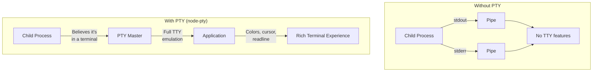

#### PTY Capabilities Enabled

| Feature | Without PTY | With PTY |
|---------|-------------|----------|
| ANSI colors | Limited | Full support |
| Cursor movement | None | Full support |
| Line editing | None | readline, etc. |
| Signal handling | SIGTERM only | Full (Ctrl+C, etc.) |
| Interactive prompts | Broken | Working |
| Window resize | N/A | SIGWINCH |

### ABI (Application Binary Interface) Versioning

The ABI version determines binary compatibility:

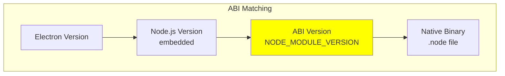

#### NODE_MODULE_VERSION Mapping

| Electron Version | Chrome Version | Node.js Version | ABI Version |
|-----------------|----------------|-----------------|-------------|
| Electron 28 | Chrome 120 | Node 18.18.2 | **119** |
| **Electron 29** | Chrome 122 | Node 20.9.0 | **120** |
| Electron 30 | Chrome 124 | Node 20.11.1 | **121** |
| Electron 31 | Chrome 126 | Node 20.14.0 | **123** |
| **Electron 32** | Chrome 128 | Node 20.16.0 | **128** |
| Electron 33 | Chrome 130 | Node 20.18.0 | **130** |

**Critical**: A native module compiled for ABI 120 will **not** load in Electron 32 (ABI 128).

---

## 3. Build Pipeline

### Native Module Compilation Process

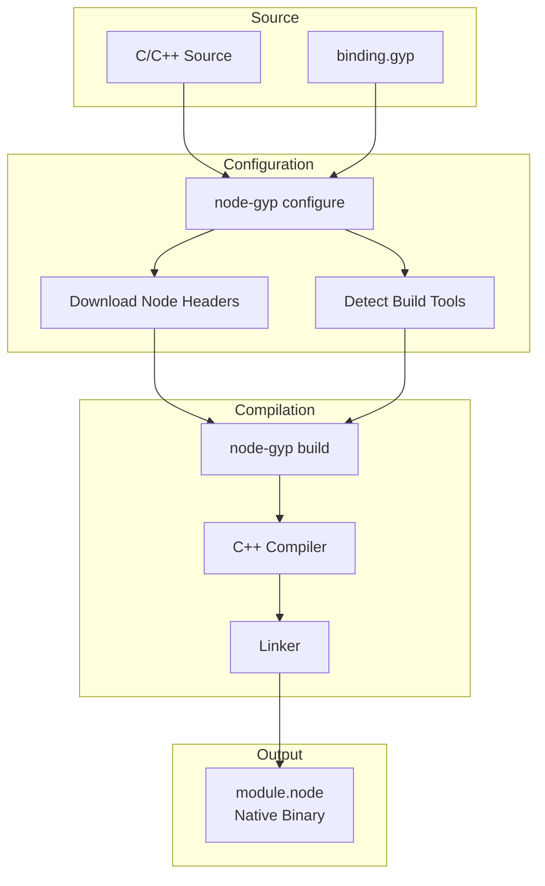

### @electron/rebuild vs electron-rebuild

| Package | Status | Features |
|---------|--------|----------|
| `electron-rebuild` | **Deprecated** | Legacy package |
| `@electron/rebuild` | **Current** | Official Electron tool |

#### Usage in package.json

```json
{
  "devDependencies": {
    "@electron/rebuild": "^3.6.0"
  },
  "scripts": {
    "rebuild": "electron-rebuild -f -w @cdktf/node-pty-prebuilt-multiarch"
  }
}
```

#### Rebuild Options

```bash
# Force rebuild specific module
electron-rebuild -f -w node-pty

# Rebuild all native modules
electron-rebuild

# Rebuild with specific Electron version
electron-rebuild --version 29.4.6

# Rebuild with specific ABI
electron-rebuild --module-dir ./node_modules/node-pty --abi 120
```

### prebuild-install and Prebuilt Binaries

`prebuild-install` downloads pre-compiled binaries instead of building from source:

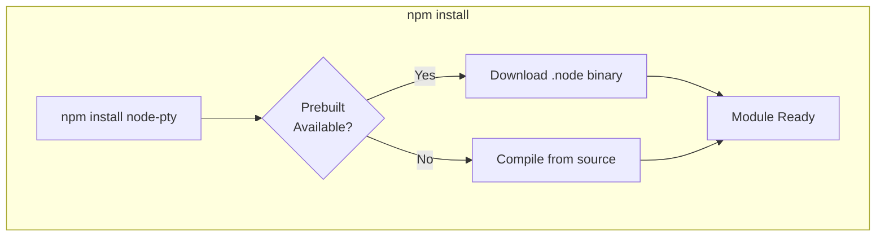

#### Prebuilds Directory Structure

```
node_modules/@cdktf/node-pty-prebuilt-multiarch/
├── prebuilds/
│   ├── win32-x64/
│   │   ├── node.abi120.node      # Electron 29
│   │   ├── node.abi128.node      # Electron 32
│   │   └── node.napi.node        # N-API (version agnostic)
│   ├── darwin-x64/
│   │   ├── node.abi120.node
│   │   └── node.abi128.node
│   ├── darwin-arm64/
│   │   ├── node.abi120.node
│   │   └── node.abi128.node
│   └── linux-x64/
│       ├── node.abi120.node
│       └── node.abi128.node
├── lib/
│   └── index.js                  # Runtime loader
└── binding.gyp                   # Fallback build config
```

#### Prebuild Filename Convention

```
{runtime}.{abi}.node
  │         │
  │         └── ABI version or 'napi'
  └── 'node' for Node.js, 'electron' for Electron-specific
```

### Build Pipeline Flow

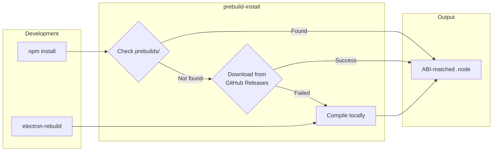

---

## 4. Windows-Specific Concerns

### conpty vs winpty APIs

Windows provides two PTY implementations:

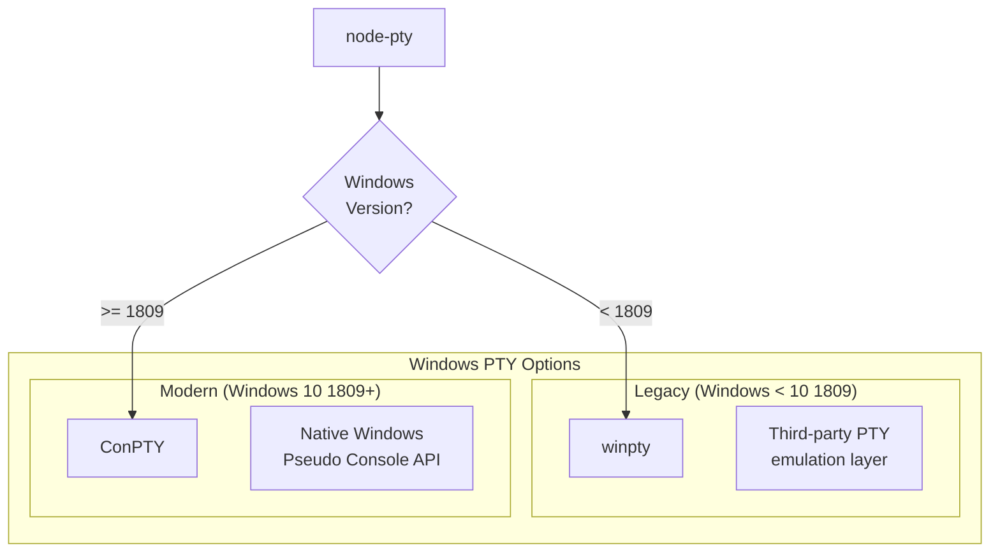

#### Comparison

| Aspect | winpty | ConPTY |
|--------|--------|--------|
| Windows Version | XP+ | 10 1809+ |
| Type | Third-party | Native API |
| Performance | Good | Better |
| Compatibility | Excellent | Some edge cases |
| Maintenance | Community | Microsoft |

#### node-pty Windows Usage

```typescript
// C:\claude_projects\claude-cli\claude-code-manager\src\main\services\session-manager.ts

import { spawn } from '@cdktf/node-pty-prebuilt-multiarch'

// node-pty automatically selects conpty or winpty
const pty = spawn('powershell.exe', [], {
  name: 'xterm-256color',
  cols: 120,
  rows: 30,
  cwd: projectPath,
  env: {
    ...process.env,
    TERM: 'xterm-256color',
    COLORTERM: 'truecolor'
  }
})
```

### Python Dependency for node-gyp

node-gyp requires Python for configuration:

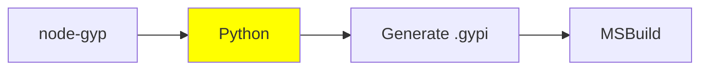

#### Python Version Requirements

| node-gyp Version | Python Version |
|------------------|----------------|
| < 9.0 | Python 2.7 or 3.6-3.11 |
| >= 9.0 | Python 3.6-3.11 |
| >= 10.0 | Python 3.6-3.12 |

### Visual Studio Build Tools

Windows native module compilation requires:

```
Visual Studio Build Tools 2019/2022
├── MSVC v142/v143 C++ Build Tools
├── Windows 10/11 SDK
└── C++ CMake tools (optional)
```

#### Installation

```powershell
# Option 1: Visual Studio Installer
# Select "Desktop development with C++"

# Option 2: npm windows-build-tools (deprecated)
npm install --global windows-build-tools

# Option 3: Manual
winget install Microsoft.VisualStudio.2022.BuildTools
```

### distutils Removal in Python 3.13 (PEP 632)

**Critical Breaking Change**: Python 3.13 removes `distutils`, which node-gyp historically depended on.

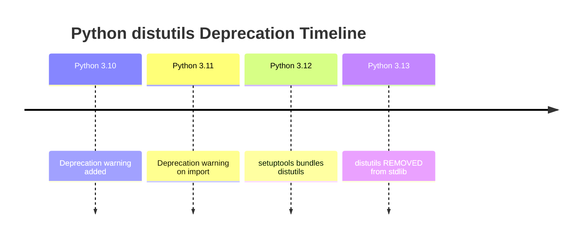

#### Impact on node-gyp

| node-gyp Version | Python 3.13 Support |
|------------------|---------------------|
| < 10.0 | **Broken** - requires distutils |
| >= 10.0 | Supported - uses setuptools |

#### Mitigation Strategies

```bash
# Strategy 1: Use node-gyp >= 10.0
npm install -g node-gyp@latest

# Strategy 2: Install setuptools (provides distutils)
pip install setuptools

# Strategy 3: Use Python 3.12 (recommended for stability)
# Set in npm config
npm config set python "C:\\Python312\\python.exe"
```

---

## 5. Code Relationships

### File Structure Overview

```
claude-code-manager/
├── src/
│   ├── main/
│   │   ├── index.ts              # Main process entry
│   │   ├── ipc/
│   │   │   └── index.ts          # IPC handler registration
│   │   └── services/
│   │       └── session-manager.ts # node-pty integration
│   ├── preload/
│   │   └── index.ts              # Context bridge
│   ├── renderer/
│   │   └── ...                   # React UI
│   └── shared/
│       └── types.ts              # Shared type definitions
├── electron.vite.config.ts       # Build configuration
└── package.json                  # Dependencies & scripts
```

### session-manager.ts - node-pty Integration

**File**: `C:\claude_projects\claude-cli\claude-code-manager\src\main\services\session-manager.ts`

```typescript
import { spawn, IPty } from '@cdktf/node-pty-prebuilt-multiarch'

export class SessionManager extends EventEmitter {
  private sessions: Map<string, PtySession> = new Map()

  create(projectPath: string): Session {
    // Platform-aware shell selection
    const shell = platform() === 'win32'
      ? 'powershell.exe'
      : process.env.SHELL || '/bin/bash'

    // Spawn PTY with terminal capabilities
    const pty = spawn(shell, [], {
      name: 'xterm-256color',
      cols: 120,
      rows: 30,
      cwd: projectPath,
      env: {
        ...process.env,
        TERM: 'xterm-256color',
        COLORTERM: 'truecolor'
      }
    })

    // Handle PTY events
    pty.onData((data) => { /* forward to renderer */ })
    pty.onExit(({ exitCode }) => { /* handle exit */ })

    return session
  }
}
```

### electron.vite.config.ts - Dependency Externalization

**File**: `C:\claude_projects\claude-cli\claude-code-manager\electron.vite.config.ts`

```typescript
import { defineConfig, externalizeDepsPlugin } from 'electron-vite'

export default defineConfig({
  main: {
    plugins: [externalizeDepsPlugin()],
    // externalizeDepsPlugin() automatically externalizes:
    // - All dependencies (including node-pty)
    // - electron
    // - Node.js built-ins
    // This prevents Vite from bundling native modules
  },
  preload: {
    plugins: [externalizeDepsPlugin()],
  },
  renderer: {
    // Renderer doesn't need externalization
    // Native modules are accessed via IPC
  }
})
```

#### Why Externalization Matters

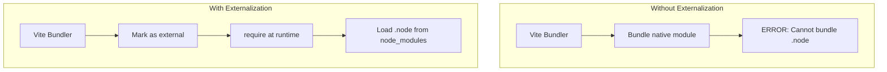

### package.json - Rebuild Scripts

**File**: `C:\claude_projects\claude-cli\claude-code-manager\package.json`

```json
{
  "scripts": {
    "rebuild": "electron-rebuild -f -w @cdktf/node-pty-prebuilt-multiarch"
  },
  "devDependencies": {
    "electron": "^29.4.6",
    "@electron/rebuild": "^3.6.0",
    "@cdktf/node-pty-prebuilt-multiarch": "^0.10.2",
    "node-gyp": "^12.1.0"
  }
}
```

#### Script Breakdown

```bash
electron-rebuild
  -f                              # Force rebuild (ignore cache)
  -w @cdktf/node-pty-prebuilt-multiarch  # Only rebuild this module
```

### Dependency Flow

```mermaid
graph TB
    subgraph "Runtime Dependencies"
        XTERM[xterm] --> RENDERER
        ZUSTAND[zustand] --> RENDERER
    end

    subgraph "Main Process"
        PTY[@cdktf/node-pty-prebuilt-multiarch]
        STORE[electron-store]
        CHOKIDAR[chokidar]
    end

    subgraph "Build Dependencies"
        REBUILD[@electron/rebuild]
        GYPC[node-gyp]
        VITE[electron-vite]
    end

    REBUILD --> PTY
    GYPC --> REBUILD
    PTY --> SM[session-manager.ts]
    SM --> IPC
    IPC --> RENDERER[Renderer Process]
```

---

## External References

### Official Documentation

- **@electron/rebuild**: https://github.com/electron/rebuild
  - Official tool for rebuilding native modules against Electron's Node.js

- **prebuild-install**: https://github.com/prebuild/prebuild-install
  - Downloads prebuilt binaries for native modules

- **node-pty**: https://github.com/microsoft/node-pty
  - Microsoft's fork of node-pty with improved Windows support

### Additional Resources

- [Electron Process Model](https://www.electronjs.org/docs/latest/tutorial/process-model)
- [Context Isolation](https://www.electronjs.org/docs/latest/tutorial/context-isolation)
- [Native Node Modules](https://www.electronjs.org/docs/latest/tutorial/using-native-node-modules)
- [Node-API Documentation](https://nodejs.org/api/n-api.html)
- [PEP 632 - distutils deprecation](https://peps.python.org/pep-0632/)
- [ConPTY Documentation](https://docs.microsoft.com/en-us/windows/console/creating-a-pseudoconsole-session)

---

## Troubleshooting Guide

### Common Issues

#### "Module did not self-register"

**Cause**: ABI mismatch between compiled module and Electron
**Solution**:
```bash
npm run rebuild
# or
./node_modules/.bin/electron-rebuild -f
```

#### "No prebuilt binaries found"

**Cause**: Platform/ABI combination not available
**Solution**: Compile from source (requires build tools)

#### "gyp ERR! find Python"

**Cause**: Python not found or wrong version
**Solution**:
```bash
npm config set python /path/to/python3
# or install Python 3.12
```

#### "MSB8020: The build tools for v142 cannot be found"

**Cause**: Visual Studio Build Tools not installed
**Solution**: Install Visual Studio Build Tools with C++ workload

---

## Search Keywords

`electron` `native-modules` `node-pty` `pty` `pseudo-terminal` `node-gyp` `prebuild` `abi` `node-module-version` `ipc` `preload` `context-bridge` `conpty` `winpty` `electron-rebuild` `externalize-deps` `binding.gyp`
