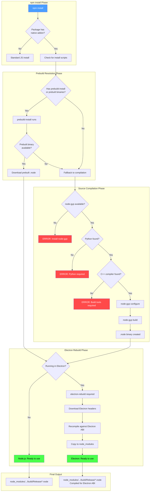
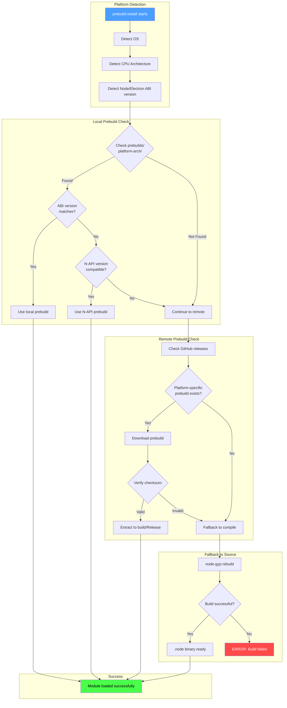
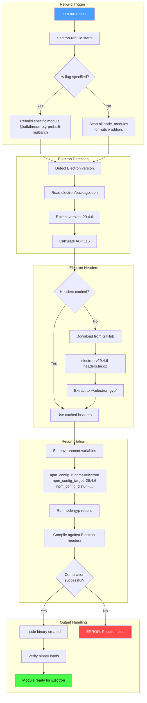
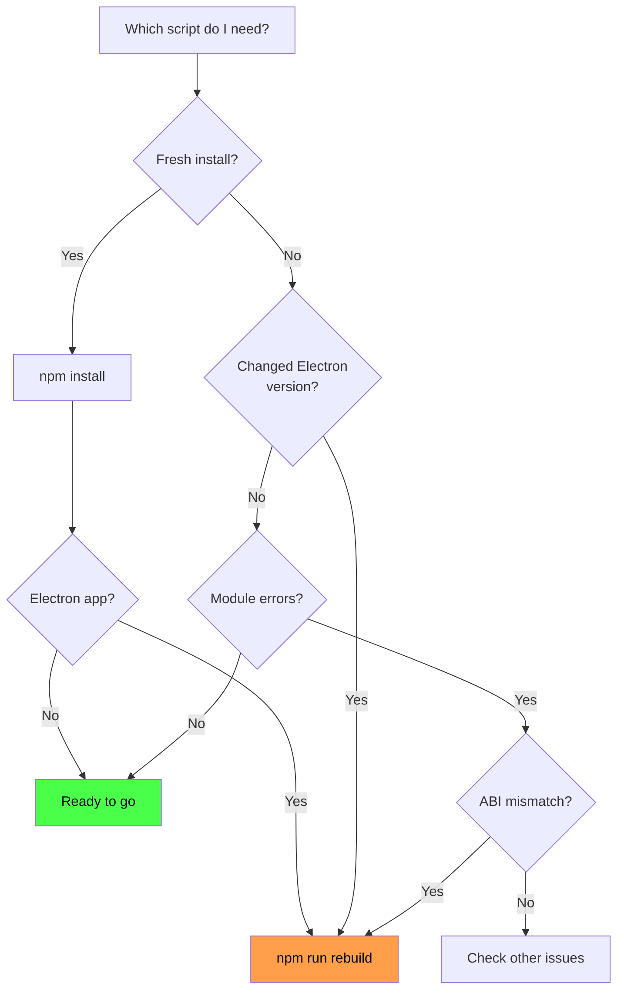

# Native Module Build Flow for Electron Applications

## Overview

### Purpose

This document provides a comprehensive reference for understanding how native Node.js modules (specifically `.node` binary addons) are built, resolved, and integrated within Electron applications. It covers the complete lifecycle from `npm install` through to the final usable binary.

### When This Flow Applies

This documentation is relevant when:

- Installing native modules like `node-pty`, `better-sqlite3`, `sharp`, or other C++ addons
- Building an Electron application that requires native bindings
- Troubleshooting build failures related to Python, C++ compilers, or ABI mismatches
- Understanding why `electron-rebuild` is necessary
- Debugging "MODULE_NOT_FOUND" or "Invalid ELF header" errors
- Working with prebuilt binaries vs source compilation

### Key Dependencies in This Project

From `package.json`:
```json
{
  "devDependencies": {
    "@cdktf/node-pty-prebuilt-multiarch": "^0.10.2",
    "@electron/rebuild": "^3.6.0",
    "node-gyp": "^12.1.0",
    "electron": "^29.4.6"
  },
  "scripts": {
    "rebuild": "electron-rebuild -f -w @cdktf/node-pty-prebuilt-multiarch"
  }
}
```

---

## Complete Build Flow Diagram

This diagram shows the entire journey from `npm install` to a working native module in Electron.



### Flow Description

1. **npm install Phase**: Package manager detects if the package contains native code (indicated by `binding.gyp` or install scripts)

2. **Prebuild Resolution Phase**: Modern packages often ship with prebuilt binaries for common platforms, avoiding compilation

3. **Source Compilation Phase**: Falls back to building from source using node-gyp, requiring:
   - Python (3.x recommended)
   - C++ compiler (MSVC on Windows, GCC/Clang on Unix)
   - node-gyp toolchain

4. **Electron Rebuild Phase**: Even with successful compilation, Electron requires recompilation against its specific V8/Node ABI

---

## Prebuild Resolution Flow

This diagram details how `prebuild-install` resolves the correct prebuilt binary.



### Prebuild Naming Convention

Prebuilt binaries follow a specific naming pattern:
```
{package}-v{version}-{runtime}-v{abi}-{platform}-{arch}.tar.gz
```

Example:
```
node-pty-v0.10.2-electron-v116-win32-x64.tar.gz
node-pty-v0.10.2-napi-v6-darwin-arm64.tar.gz
```

### ABI Version Matrix

| Runtime    | Version | ABI  |
|------------|---------|------|
| Node.js 18 | 18.x    | 108  |
| Node.js 20 | 20.x    | 115  |
| Node.js 22 | 22.x    | 127  |
| Electron 29| 29.x    | 116  |
| N-API      | v6+     | napi |

### N-API Advantage

N-API (Node-API) provides ABI stability across Node.js versions:
- One binary works across multiple Node versions
- Marked as `napi` instead of specific ABI number
- Preferred for modern native modules

---

## Electron Rebuild Flow

This diagram shows exactly what `@electron/rebuild` does.



### Why Electron Rebuild is Necessary

```
Standard Node.js:
  your-app -> node.exe -> V8 (Node's version) -> native-module.node

Electron:
  your-app -> electron.exe -> V8 (Chromium's version) -> native-module.node
                                     ^
                                     |
                          Different ABI! Must recompile.
```

The V8 JavaScript engine bundled with Electron comes from Chromium and has a different ABI (Application Binary Interface) than the V8 in standard Node.js, even for the same Node.js version number.

### Environment Variables Set by electron-rebuild

```bash
npm_config_runtime=electron
npm_config_target=29.4.6
npm_config_arch=x64
npm_config_disturl=https://electronjs.org/headers
npm_config_build_from_source=true
```

---

## Package.json Scripts Explained

### Script Reference

```json
{
  "scripts": {
    "rebuild": "electron-rebuild -f -w @cdktf/node-pty-prebuilt-multiarch"
  }
}
```

### Command Breakdown

| Script | Command | Purpose |
|--------|---------|---------|
| `rebuild` | `electron-rebuild -f -w @cdktf/node-pty-prebuilt-multiarch` | Force rebuild node-pty for Electron |

### Flag Explanation

| Flag | Meaning |
|------|---------|
| `-f` | Force rebuild even if binaries exist |
| `-w <module>` | Only rebuild the specified module (whitelist) |

### When to Use Each Script



### Common Scenarios

#### Scenario 1: Fresh Clone
```bash
git clone <repo>
cd claude-code-manager
npm install
npm run rebuild    # Required for Electron!
npm run dev
```

#### Scenario 2: Updated Electron Version
```bash
npm update electron
npm run rebuild    # ABI changed, must rebuild natives
```

#### Scenario 3: CI/CD Pipeline
```yaml
- npm ci
- npm run rebuild
- npm run build
- npm run package
```

#### Scenario 4: Switching Node Versions (with nvm)
```bash
nvm use 20
npm run rebuild    # Different Node = different electron-rebuild behavior
```

### postinstall Hook Pattern

Some projects automate rebuilding:

```json
{
  "scripts": {
    "postinstall": "electron-rebuild"
  }
}
```

**Note**: This project does NOT use postinstall to give developers control over when rebuilding occurs (it can be slow).

---

## Troubleshooting Quick Reference

### Common Errors and Solutions

| Error | Cause | Solution |
|-------|-------|----------|
| `MODULE_NOT_FOUND` | Binary not built | Run `npm run rebuild` |
| `Invalid ELF header` | Wrong ABI | Run `npm run rebuild` |
| `was compiled against a different Node.js version` | ABI mismatch | Run `npm run rebuild` |
| `gyp ERR! find Python` | Python not found | Install Python 3.x |
| `gyp ERR! find VS` | No C++ compiler | Install Visual Studio Build Tools |

### Verification Commands

```bash
# Check if native module loads
node -e "require('@cdktf/node-pty-prebuilt-multiarch')"

# Check Electron version
npx electron --version

# Check rebuild targets
npx electron-rebuild --version
```

---

## Related Documentation

- [Electron Native Modules Architecture](../architecture/electron-native-modules.md)
- [Troubleshooting node-pty Issues](../troubleshooting/troubleshooting-node-pty.md)

---

## Search Keywords

`native-module` `electron-rebuild` `node-gyp` `prebuild` `node-pty` `ABI` `binding.gyp` `.node` `binary` `compilation` `headers` `V8` `N-API`
