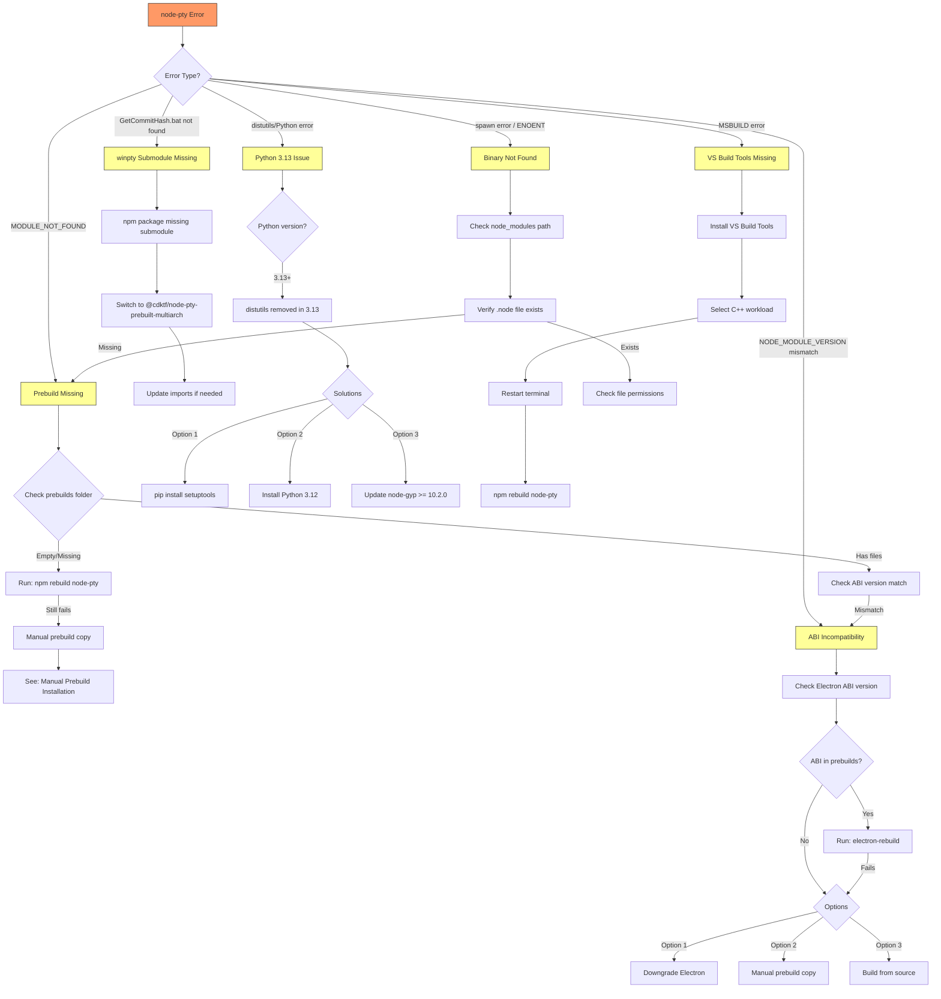

# Troubleshooting: node-pty on Windows with Electron

## Overview

This guide provides systematic troubleshooting for node-pty issues when used with Electron on Windows. node-pty is a native Node.js module that requires compilation against specific ABI (Application Binary Interface) versions, making it particularly susceptible to version mismatches in Electron environments.

**Related Documentation:**
- [Native Module Build Flow](./native-module-build-flow.md) - Understanding how native modules are built
- [node-pty Windows Fix](../issues/node-pty-windows-fix.md) - Specific fix applied to this project

---

## Decision Tree: Diagnosing node-pty Errors



---

## Error: NODE_MODULE_VERSION Mismatch

### Symptoms

```
Error: The module '\\?\C:\path\to\node_modules\node-pty\build\Release\pty.node'
was compiled against a different Node.js version using
NODE_MODULE_VERSION 127. This version of Node.js requires
NODE_MODULE_VERSION 128. Please try re-compiling or re-installing
the module (for instance, using `npm rebuild` or `npm install`).
```

Or variations like:
```
NODE_MODULE_VERSION 115 vs NODE_MODULE_VERSION 127
```

### Root Cause

Native Node.js modules like node-pty compile against a specific **ABI (Application Binary Interface) version**. Electron bundles its own version of Node.js which has its own ABI version that typically differs from system Node.js.

**ABI Version Reference:**

| Runtime | Version | ABI (NODE_MODULE_VERSION) |
|---------|---------|---------------------------|
| Node.js | 18.x | 108 |
| Node.js | 20.x | 115 |
| Node.js | 22.x | 127 |
| Node.js | 23.x | 131 |
| Electron | 28.x | 119 |
| Electron | 29.x | 120 |
| Electron | 30.x | 123 |
| Electron | 31.x | 125 |
| Electron | 32.x | 128 |
| Electron | 33.x | 130 |
| Electron | 34.x | 132 |

### Solution Steps

#### Step 1: Identify Required ABI Version

```bash
# Check Electron's ABI version
npx electron -e "console.log(process.versions.modules)"

# Check system Node.js ABI version
node -e "console.log(process.versions.modules)"
```

#### Step 2: Rebuild for Electron

```bash
# Install electron-rebuild
npm install --save-dev @electron/rebuild

# Rebuild native modules
npx electron-rebuild

# Or rebuild specific module
npx electron-rebuild -f -w node-pty
```

#### Step 3: If electron-rebuild Fails

If the ABI version is not available in prebuilds:

```bash
# Check available prebuilds
dir node_modules\@cdktf\node-pty-prebuilt-multiarch\prebuilds\win32-x64\

# Expected output shows ABI versions:
# node.abi115.node  (Node 20)
# node.abi127.node  (Node 22)
# node.abi128.node  (Electron 32)
# etc.
```

If your ABI version is missing, see [No Prebuilt Binary](#error-no-prebuilt-binary-available).

### Prevention

1. **Lock Electron version** in package.json to a version with available prebuilds
2. **Use @cdktf/node-pty-prebuilt-multiarch** which includes more prebuilds
3. **Document ABI requirements** in project README
4. **Test after Electron upgrades** before committing

---

## Error: Python distutils Missing

### Symptoms

```
ModuleNotFoundError: No module named 'distutils'
```

Or during `npm install` / `npm rebuild`:

```
gyp ERR! find Python
gyp ERR! configure error
gyp ERR! stack Error: Could not find any Python installation to use
```

Or:

```
node-gyp rebuild
...
ModuleNotFoundError: No module named 'distutils'
gyp ERR! build error
```

### Root Cause

**Python 3.13 removed the `distutils` module** (deprecated since Python 3.10, removed in 3.12 per PEP 632). The `node-gyp` build tool relies on `distutils` for building native modules.

### Solutions

#### Solution 1: Install setuptools (Recommended)

```bash
# setuptools provides distutils compatibility
pip install setuptools

# Or with specific Python version
py -3.13 -m pip install setuptools
```

#### Solution 2: Use Python 3.12 or Earlier

```bash
# Install Python 3.12 alongside 3.13
# Download from python.org or use pyenv-win

# Set Python path for node-gyp
npm config set python "C:\Python312\python.exe"

# Or use environment variable
set PYTHON=C:\Python312\python.exe
npm rebuild node-pty
```

#### Solution 3: Update node-gyp

```bash
# node-gyp 10.2.0+ includes distutils workaround
npm install -g node-gyp@latest

# Verify version
node-gyp --version  # Should be >= 10.2.0

# Force npm to use updated node-gyp
npm config set node_gyp "$(npm prefix -g)/lib/node_modules/node-gyp/bin/node-gyp.js"
```

### node-gyp Version Requirements

| node-gyp Version | Python Support | Notes |
|-----------------|----------------|-------|
| < 10.0.0 | Python 2.7, 3.6-3.11 | Legacy |
| 10.0.0 - 10.1.x | Python 3.6-3.12 | No 3.13 support |
| >= 10.2.0 | Python 3.6-3.13 | setuptools fallback |

---

## Error: No Prebuilt Binary Available

### Symptoms

```
prebuild-install warn install No prebuilt binaries found
(target=32.0.0 runtime=electron arch=x64 libc=glibc platform=win32)
```

Or build attempts followed by:

```
gyp ERR! build error
gyp ERR! stack Error: `msbuild` failed with exit code: 1
```

### Root Cause

The node-pty package includes prebuilt binaries for common Node.js/Electron ABI versions. When using a newer Electron version, the matching ABI prebuild may not exist yet.

**Prebuild availability depends on:**
1. Package maintainers building for specific ABI versions
2. Time lag between Electron releases and prebuild updates
3. Package choice (original vs forked packages)

### Solutions

#### Solution 1: Use Package with More Prebuilds

```bash
# Uninstall original
npm uninstall node-pty

# Install fork with more prebuilds
npm install @cdktf/node-pty-prebuilt-multiarch
```

Update imports:
```javascript
// Before
const pty = require('node-pty');

// After
const pty = require('@cdktf/node-pty-prebuilt-multiarch');
```

For TypeScript:
```typescript
// Before
import { spawn, IPty } from 'node-pty'

// After
import { spawn, IPty } from '@cdktf/node-pty-prebuilt-multiarch'
```

#### Solution 2: Downgrade Electron

Check which Electron versions have prebuilds:

```bash
# List available prebuilds
dir node_modules\@cdktf\node-pty-prebuilt-multiarch\prebuilds\win32-x64\

# Find corresponding Electron version for available ABI
# See ABI table above
```

Downgrade Electron:
```bash
npm install electron@29.4.6  # Example: has ABI 120
```

#### Solution 3: Manual Prebuild Copy

If a close ABI version exists, you can sometimes copy and rename:

```bash
cd node_modules\@cdktf\node-pty-prebuilt-multiarch\prebuilds\win32-x64\

# Copy nearest ABI version (use with caution)
copy node.abi127.node node.abi128.node
```

**Warning:** This is a workaround and may cause instability. Only use for testing or when no other option exists.

### Manual Prebuild Installation Steps

1. **Find prebuild source:**
   ```bash
   # Check package's prebuild releases
   # GitHub releases often have .node files
   ```

2. **Download correct prebuild:**
   - Match: OS (win32), Architecture (x64/arm64), ABI version

3. **Place in correct location:**
   ```
   node_modules/@cdktf/node-pty-prebuilt-multiarch/
     prebuilds/
       win32-x64/
         node.abi{VERSION}.node
   ```

4. **Verify installation:**
   ```javascript
   const pty = require('@cdktf/node-pty-prebuilt-multiarch');
   console.log('node-pty loaded successfully');
   ```

---

## Error: GetCommitHash.bat Not Found

### Symptoms

```
'.' is not recognized as an internal or external command
.\build\GetCommitHash.bat was unexpected at this time.
```

Or:

```
Error: spawn .\build\GetCommitHash.bat ENOENT
```

Or:

```
error MSB3073: The command "...\node_modules\node-pty\deps\winpty\src\vs-build\GetCommitHash.bat" exited with code 9009.
```

### Root Cause

The original `node-pty` package uses a git submodule for `winpty` on Windows. **npm does not include git submodules** when publishing packages, so the `winpty` source files (including build scripts) are missing.

This is a known issue: https://github.com/microsoft/node-pty/issues/442

### Solution

**Switch to a fork that bundles winpty prebuilts:**

```bash
# Uninstall original
npm uninstall node-pty

# Install maintained fork with prebuilts
npm install @cdktf/node-pty-prebuilt-multiarch
```

The `@cdktf/node-pty-prebuilt-multiarch` package:
- Bundles prebuilt winpty binaries
- Does not require the git submodule
- Includes prebuilds for multiple platforms/ABIs
- Is actively maintained by the CDK for Terraform team

### Alternative: Clone and Build Manually

If you must use the original package:

```bash
# Clone with submodules
git clone --recurse-submodules https://github.com/microsoft/node-pty.git
cd node-pty

# Install dependencies
npm install

# Build
npm run build
```

Then copy the built files to your project's `node_modules/node-pty`.

---

## Error: MSBUILD / Visual Studio Build Tools Missing

### Symptoms

```
gyp ERR! find VS
gyp ERR! find VS msvs_version not set from command line or npm config
gyp ERR! find VS could not find a version of Visual Studio
```

Or:

```
MSBUILD : error MSB3428: Could not load the Visual C++ component "VCBuild.exe"
```

Or:

```
gyp ERR! stack Error: `msbuild` failed with exit code: 1
```

### Root Cause

Native Node.js modules require compilation on Windows using Microsoft Visual Studio Build Tools. These are not installed by default.

### Solution

#### Step 1: Install Visual Studio Build Tools

**Option A: Via npm (Recommended)**
```bash
# Run as Administrator
npm install --global windows-build-tools
```

**Option B: Manual Installation**
1. Download from: https://visualstudio.microsoft.com/visual-cpp-build-tools/
2. Run installer
3. Select **"Desktop development with C++"** workload
4. Ensure these are checked:
   - MSVC v143 - VS 2022 C++ x64/x86 build tools
   - Windows 10/11 SDK
   - C++ CMake tools for Windows

#### Step 2: Configure npm

```bash
# Set Visual Studio version (if multiple installed)
npm config set msvs_version 2022

# Verify configuration
npm config list
```

#### Step 3: Rebuild

```bash
# Close and reopen terminal (as Administrator if needed)
npm rebuild node-pty
```

### Troubleshooting Build Tools

```bash
# Check if build tools are detected
npx node-gyp configure

# Verbose output for debugging
npm rebuild node-pty --verbose
```

---

## Quick Reference Table

| Error Message | Cause | Quick Fix |
|--------------|-------|-----------|
| `NODE_MODULE_VERSION X vs Y` | ABI mismatch between Node.js/Electron | `npx electron-rebuild` or match Electron version to available prebuilds |
| `No module named 'distutils'` | Python 3.13 removed distutils | `pip install setuptools` or use Python 3.12 |
| `No prebuilt binaries found` | ABI version not in prebuilds | Use `@cdktf/node-pty-prebuilt-multiarch` or downgrade Electron |
| `GetCommitHash.bat ENOENT` | winpty submodule missing from npm | Switch to `@cdktf/node-pty-prebuilt-multiarch` |
| `MSBUILD failed` | VS Build Tools not installed | Install Visual Studio Build Tools with C++ workload |
| `could not find Visual Studio` | VS Build Tools not found | Install VS Build Tools, run `npm config set msvs_version 2022` |
| `spawn ... ENOENT` | Binary file missing or not found | Check `prebuilds/` folder, rebuild, or reinstall |
| `MODULE_NOT_FOUND: pty.node` | Native module not built/installed | `npm rebuild node-pty` or `npx electron-rebuild` |

---

## Diagnostic Commands

```bash
# Check Node.js version and ABI
node -e "console.log('Node:', process.version, 'ABI:', process.versions.modules)"

# Check Electron version and ABI
npx electron -e "console.log('Electron:', process.versions.electron, 'ABI:', process.versions.modules)"

# Check Python version
python --version
py -3 --version

# Check node-gyp version
node-gyp --version
npx node-gyp --version

# List installed prebuilds (Windows)
dir node_modules\@cdktf\node-pty-prebuilt-multiarch\prebuilds\win32-x64\

# Test node-pty loading in Node.js
node -e "try { require('@cdktf/node-pty-prebuilt-multiarch'); console.log('OK'); } catch(e) { console.log(e.message); }"

# Test in Electron context
npx electron -e "try { require('@cdktf/node-pty-prebuilt-multiarch'); console.log('OK'); } catch(e) { console.log(e.message); }"

# Check if binary file exists
dir node_modules\@cdktf\node-pty-prebuilt-multiarch\build\Release\pty.node
```

---

## This Project's Configuration

Based on the fix applied (see [node-pty-windows-fix.md](../issues/node-pty-windows-fix.md)):

**package.json:**
```json
{
  "devDependencies": {
    "electron": "^29.4.6",
    "@electron/rebuild": "^3.6.0",
    "@cdktf/node-pty-prebuilt-multiarch": "^0.10.2"
  },
  "scripts": {
    "rebuild": "electron-rebuild -f -w @cdktf/node-pty-prebuilt-multiarch"
  }
}
```

**After fresh install:**
```bash
npm install
npm run rebuild
```

---

## Related Documentation

### Internal
- [Native Module Build Flow](./native-module-build-flow.md) - Complete flow diagrams for native module compilation
- [node-pty Windows Fix](../issues/node-pty-windows-fix.md) - Detailed documentation of the specific fix applied to this project

### External
- **Electron Native Modules:** https://www.electronjs.org/docs/latest/tutorial/using-native-node-modules
- **node-pty GitHub:** https://github.com/microsoft/node-pty
- **@cdktf/node-pty-prebuilt-multiarch:** https://www.npmjs.com/package/@cdktf/node-pty-prebuilt-multiarch
- **node-gyp:** https://github.com/nodejs/node-gyp
- **PEP 632 (distutils deprecation):** https://peps.python.org/pep-0632/

---

## Search Keywords

`node-pty` `windows` `electron` `NODE_MODULE_VERSION` `ABI` `prebuild` `native module` `distutils` `python 3.13` `node-gyp` `MSBUILD` `Visual Studio Build Tools` `GetCommitHash.bat` `winpty` `@cdktf/node-pty-prebuilt-multiarch` `electron-rebuild` `PEP 632`
